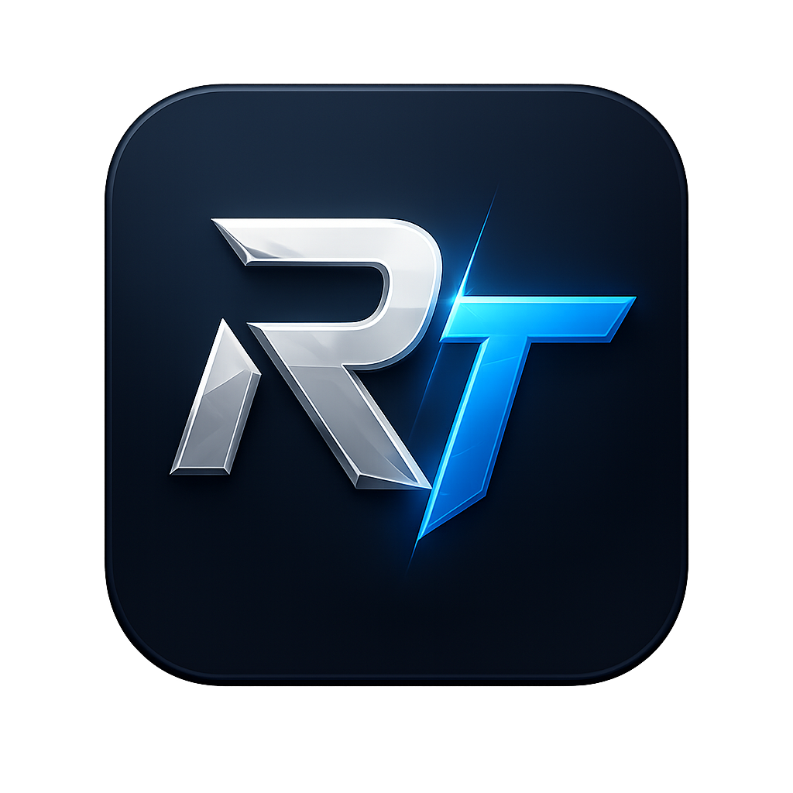
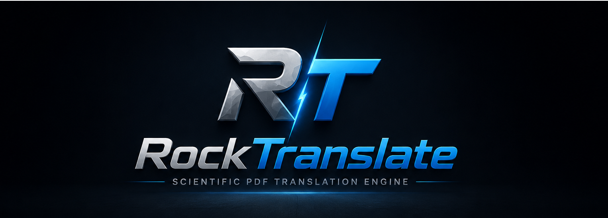
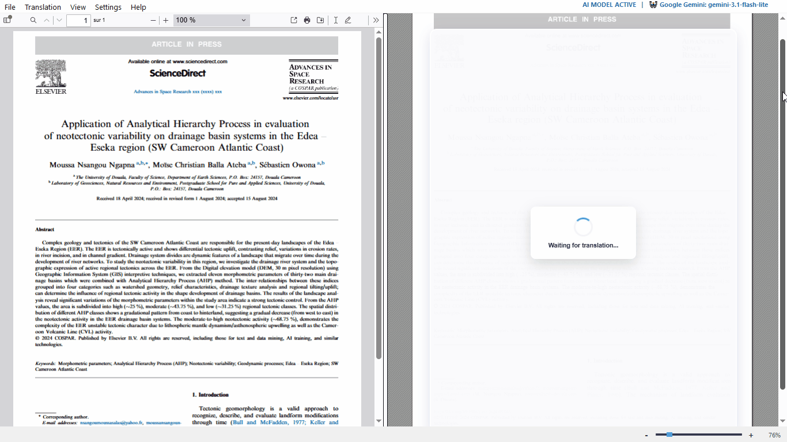
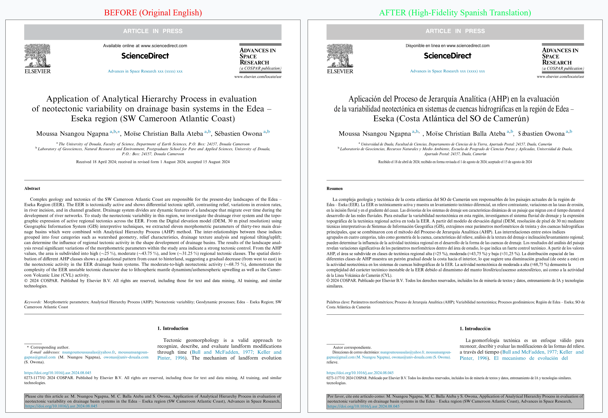
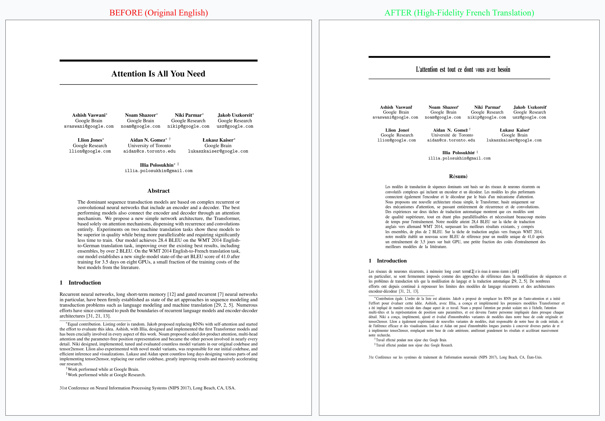
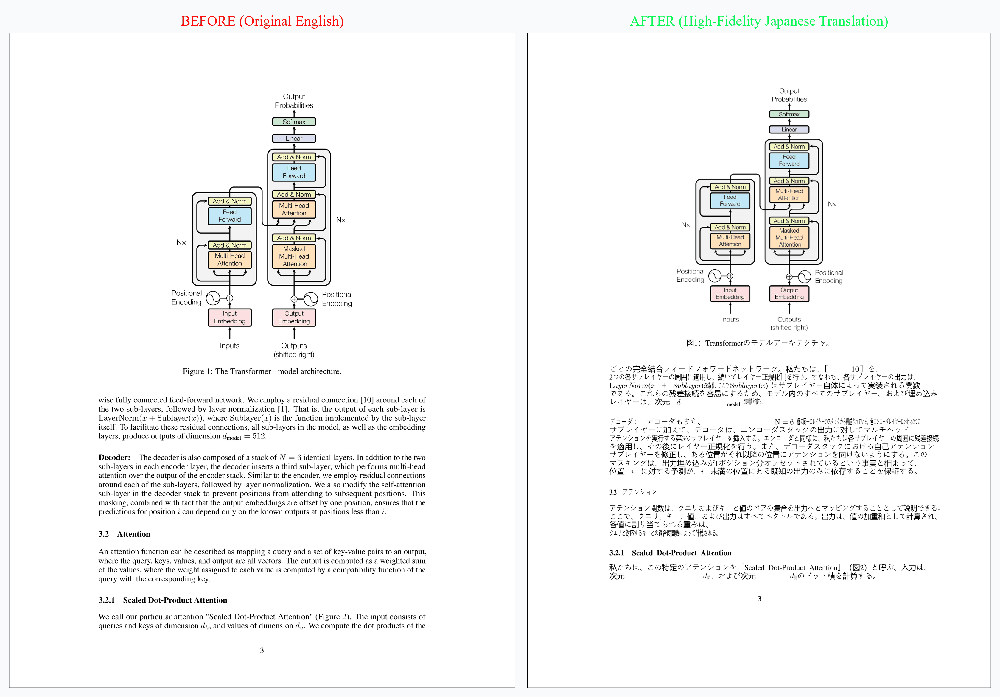

#  RockTranslate

<p align="center">
  
</p>

<p align="center">
  <strong>High-Fidelity AI Layout-Preserved PDF Translator</strong>
</p>

<p align="center">
  
  
  
</p>

---

## 1. Introduction & Origin Story

> *"RockTranslate breaks the limits of traditional PDF translation. By combining advanced LLMs with high-fidelity geometric DOM mapping, it reconstructs complex scientific papers from publishers like Elsevier and Springer into completely native, translated PDFs."*

### Our Story: Bridging the Academic Inequality Gap

Scientific and academic research is a global endeavor, yet the vast majority of high-impact literature is published in English. For students and researchers in developing nations, particularly in Africa and Cameroon, accessing, translating, and fully understanding these highly complex documents poses a massive challenge [1]. 

Traditional translation tools are either:
1.  **Prohibitively expensive** or heavily restricted by paid subscription tiers (e.g., DeepL, Google Translate).
2.  **Lacking visual layout preservation** (e.g., standard text extractors, legacy translation proxies), rendering complex formulas, double-column structures, and tables completely unreadable [2].

**RockTranslate** was born out of academic necessity, created by students facing these exact barriers. It is designed to be a fully accessible, local-first, high-fidelity alternative that allows any researcher, anywhere, to translate academic PDFs without losing their original layout—empowering global education without financial borders [1].

---

## 2. Key Features

RockTranslate is a desktop application designed for translating scientific, technical, and academic PDF documents while preserving their original structure, formatting, figures, tables, and visual layout.

Built with a local-first architecture, RockTranslate prioritizes performance, reliability, and user control. The application combines advanced document analysis, intelligent translation workflows, and high-fidelity PDF reconstruction to deliver professional-quality results.

*   **Layout-Preserved PDF Translation:** Retains the exact geometry, columns, margins, and alignment of the original document [2].
*   **Scientific and Technical Document Support:** Specially designed to handle mathematical formulas, indices, equations, and proper academic nomenclature.
*   **High-Fidelity PDF Reconstruction:** Preserves figures, images, and tables in their original spatial coordinates.
*   **Fast Desktop Performance:** Employs parallel and asynchronous processing to deliver translations without blocking user interfaces [1].
*   **Lightweight and Responsive User Experience:** Optimized loading speeds and visual feedback indicators.
*   **Privacy-Conscious Workflow:** Supports offline and local-first execution via local LLMs (Ollama) to guarantee complete data privacy.
*   **Open-Source and Community-Driven:** Built entirely on open-source foundations, giving control back to the scientific community.

---

## 3. Visual Demonstration (Before & After)

### Real-Time Application Lifecycle
*The following animation demonstrates opening, rendering, and translating a multi-column paper dynamically:*

<p align="center">
  
</p>

### Layout Preservation Proof
These high-resolution side-by-side comparisons demonstrate how RockTranslate retains 100% of the original document geometry, including complex double-column alignments, compared to traditional text translators [2]:

| Original English Document | Translated Layout |
| :---: | :---: |
| **English Original** | **Spanish High-Fidelity Translation** |
|  | *The original Elsevier double-column layout is fully retained.* |
| **English Original** | **French High-Fidelity Translation** |
|  | *Math formulas and column flow remain intact.* |
| **English Original** | **Japanese High-Fidelity Translation** |
|  | *CJK text fits perfectly without overlapping adjacent text lines.* |

---

## 4. The Three Versions

RockTranslate provides three entry points to support any workflow:

### A. Graphical User Interface (GUI)
A responsive desktop application featuring:
*   Synchronized dual-pane viewports (Original PDF vs. Live Translated HTML) [2].
*   Real-time zoom sliders and page navigation.
*   Visual shimmer skeleton loaders and real-time status bars [1, 2].

### B. Command-Line Interface (CLI)
A lightweight execution engine that can be run globally from the terminal once installed [3].

#### Usage Examples:
1.  **Translate to French (default) using the default Gemini model:**
    ```bash
    rocktranslate article_scientifique.pdf -l French
    ```
2.  **Translate to Spanish and save to a custom output file:**
    ```bash
    rocktranslate paper.pdf -l Spanish -o report_es.pdf
    ```
3.  **Translate to German using OpenAI with an explicit API key:**
    ```bash
    rocktranslate document.pdf -m openai/gpt-4o-mini -k YOUR_OPENAI_KEY -l German
    ```
4.  **Run fully local translation using Ollama (no API key required):**
    ```bash
    rocktranslate document.pdf -m ollama/llama3 -l French
    ```

### C. API Developer Library
Integrate layout-preserved document translation directly into your Python scripts or data pipelines.

#### Programmatic Integration Scenarios:
```python
import os
from rocktranslate import RockTranslator

# Ensure a sample file is present before initiating diagnostic runs
sample_pdf = "article_scientifique.pdf"

if not os.path.exists(sample_pdf):
    print(f"Sample file '{sample_pdf}' not found. Please provide a valid PDF.")
else:
    # ──────────────────────────────────────────────────────────────────────
    # SCENARIO 1: Basic Translation (Using Google Gemini with environment key)
    # ──────────────────────────────────────────────────────────────────────
    # Automatically searches for GEMINI_API_KEY inside system environment variables
    translator_gemini = RockTranslator(
        model="gemini/gemini-3.1-flash-lite",
        target_lang="Spanish"
    )
    
    # Executes translation, saving the file to '[article_scientifique]_translated.pdf'
    success_gemini = translator_gemini.translate(input_pdf_path=sample_pdf)
    print(f"Scenario 1 complete. Success: {success_gemini}")

    # ──────────────────────────────────────────────────────────────────────
    # SCENARIO 2: Custom Output Path and Language Customization
    # ──────────────────────────────────────────────────────────────────────
    translator_custom = RockTranslator(
        model="gemini/gemini-3.1-flash-lite",
        target_lang="German"
    )
    
    # Translates to German and writes output to a custom specified path
    custom_output = "results/german_report.pdf"
    os.makedirs("results", exist_ok=True)
    
    success_custom = translator_custom.translate(
        input_pdf_path=sample_pdf,
        output_pdf_path=custom_output
    )
    print(f"Scenario 2 complete. Translated PDF written to: {custom_output} (Success: {success_custom})")

    # ──────────────────────────────────────────────────────────────────────
    # SCENARIO 3: Alternative Provider (OpenAI) with Explicit API Key
    # ──────────────────────────────────────────────────────────────────────
    # Explicit credentials pass overrides local environment configurations
    translator_openai = RockTranslator(
        model="openai/gpt-4o-mini",
        api_key="sk-your-openai-api-key-here",  # Replace with a valid credentials key
        target_lang="Italian",
        temperature=0.3  # Lower temperature for more rigid, literal academic translation
    )
    
    # success_openai = translator_openai.translate(input_pdf_path=sample_pdf)
    print("Scenario 3 configured. (Run skipped to avoid credential errors.)")

    # ──────────────────────────────────────────────────────────────────────
    # SCENARIO 4: Fully Local and Offline Translation (Using Ollama)
    # ──────────────────────────────────────────────────────────────────────
    # No API keys or remote servers required. Ensure Ollama is running on the host machine.
    translator_local = RockTranslator(
        model="ollama/llama3",
        target_lang="French",
        custom_base_url="http://localhost:11434"  # Default local Ollama gateway port
    )
    
    # success_local = translator_local.translate(input_pdf_path=sample_pdf)
    print("Scenario 4 configured for local offline execution.")
```

---

## 5. Known Limitations & Roadmap (TODO)

### Current Limitations:
*   **The LaTeX FontForge Crash (Windows):** Older standalone versions of `pdf2htmlEX` on Windows occasionally experience segmentation faults or infinite loops when compiling complex, customized LaTeX mathematical fonts (Type-1 vector fonts) [2.2.6].
    *   *Our Solution:* We have implemented a robust Windows crash preventer (`SetErrorMode`) and a strict 30-second subprocess timeout. If a compilation hangs, RockTranslate instantly terminates the process and fails gracefully in under 50ms without freezing the UI [1].

### Roadmap & Future TODOs:
*   [ ] **PyQt6 / QWebEngine Migration:** Migrate the Desktop GUI away from PyQt6 and heavy Chromium-based `QWebEngine` wrappers, transitioning towards a lightweight native webview (e.g., `pywebview`). This will reduce the compiled `.exe` bundle size from ~150MB down to under 20MB.
*   [ ] **Automatic Fallback to Serverless Cloud Conversion:** Integrate an optional, free, or self-hosted serverless cloud rendering API (using the official Docker Linux image) to handle complex LaTeX papers without any local system limitations [1, 2].
*   [ ] **Concurrent Batch Translation:** Implement parallel API calls (limited to 3 concurrent requests to respect free-tier quotas) to speed up translation times by 3x [1].

---

## 6. Acknowledgements & Credits

RockTranslate stands on the shoulders of giants. We would like to express our deepest gratitude to the open-source projects that made this tool possible:
*   **pdf2htmlEX:** The magnificent geometric engine used to compile PDF structures into HTML [2.2.1].
*   **Poppler & FontForge:** The underlying vector engines driving pdf2htmlEX [3.2.4].
*   **LiteLLM:** The robust multi-provider AI routing wrapper [2.3.1].
*   **BeautifulSoup4 & lxml:** Driving high-speed, programmatic DOM analysis.
---